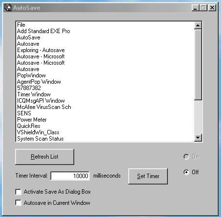

<div align="center">

## AutoSave


</div>

### Description

AutoSave is a program that automatically saves the file you are working on in the program you specify as often as you want. It is a very useful program especially if you work in a program that has crashing tendecies, and you are worried that your work might be lost. AutoSave demonstrates use of Registry, Menu and Window API calls, and is commented pretty fully.

***Autosave v1.2 is now out!*** Bugs found in the first version have been fixed, so it now works well in both VB5 and VB6! Check it out at http://www.planet-source-code.com/vb/scripts/showcode.asp?txtCodeId=12825 and be sure to vote!
 
### More Info
 
There are no actual input parameters, but in the program you have to set up what program to save in, after how long, and other variables like this.

This code uses lots of APIs including Registry APIs. The program does add some registry keys. As well, editing/modifying this program might be difficult if you do not understand APIs

Nothing, other than a new saved file.

All Advantage creates many procs (windows) and therefore has a lot of listings in my program as "MenuEventCatcher". Just try do either disregard this, or don't use AutoSave with AA. I will fix this for the next release.


<span>             |<span>
---                |---
**Submitted On**   |2000-10-18 23:15:04
**By**             |[Daniel Vandersluis](https://github.com/Planet-Source-Code/PSCIndex/blob/master/ByAuthor/daniel-vandersluis.md)
**Level**          |Advanced
**User Rating**    |4.9 (98 globes from 20 users)
**Compatibility**  |VB 5\.0, VB 6\.0
**Category**       |[Custom Controls/ Forms/  Menus](https://github.com/Planet-Source-Code/PSCIndex/blob/master/ByCategory/custom-controls-forms-menus__1-4.md)
**World**          |[Visual Basic](https://github.com/Planet-Source-Code/PSCIndex/blob/master/ByWorld/visual-basic.md)
**Archive File**   |[CODE\_UPLOAD1076710182000\.zip](https://github.com/Planet-Source-Code/daniel-vandersluis-autosave__1-12139/archive/master.zip)

### API Declarations

```
Check out the code; It uses a ton of APIs:
* Registry APIs
* Menu APIs
* Window APIs
```


